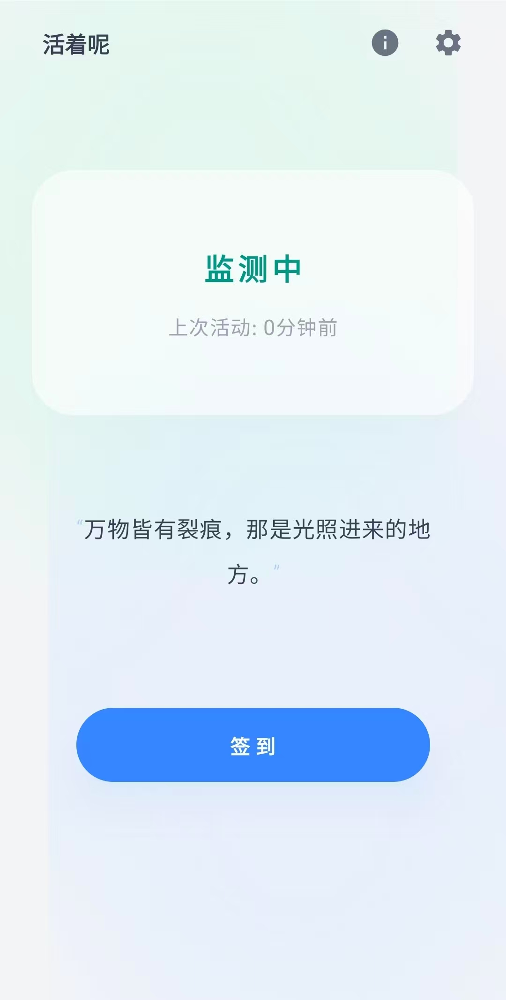

#  活着呢 | Tobe 

## 📱 Screenshots | 界面预览

  

[English](#english) | [中文](#中文)

---

## English

### 📖 Introduction
**Tobe (活着呢)** is a minimalist, proactive safety monitoring application for Android. In a world where we often live alone or travel solo, "Tobe" acts as a digital silent guardian. It ensures that if you are unresponsive for a critical period, help is on the way.

### 🌟 Features
- **Passive Activity Sensing**: Automatically refreshes your "Safe" status when you unlock your phone. No manual action needed for daily use.
- **Manual Check-in**: A large, satisfying button for those who want to actively say "I'm okay."
- **Inactivity Countdown**: Tracks the duration since your last activity. If the threshold is exceeded, it prepares to notify your emergency contacts.
- **Emergency Automation**: Automatically sends SOS SMS messages to pre-defined contacts if you become unreachable.

### 🛡️ Privacy & Safety
- **Local First**: All activity monitoring happens on-device.
- **Permission Transparency**: Requires SMS (for SOS) and Notification access.

### 🚀 Getting Started
1. Download the latest APK from [Releases](https://github.com/linden713/Tobe/releases).
2. Install on your Android device.
3. Grant necessary permissions: **SMS**, **Notifications**, and **Ignore Battery Optimization** (crucial for background monitoring).
4. Set your check-in interval and emergency contact in Settings.

---

## 中文

### 📖 简介
**活着呢 (Tobe)** 是一款极简、主动式的 Android 安全记录与监测应用。在独居或独自旅行成为常态的今天，“活着呢”作为一个沉默的数字守护者，确保在您由于突发情况长时间失联时，能够自动为您的紧急联系人发出求援信号。

### 🌟 核心功能
- **无感监测**：通过监测手机解锁行为自动刷新“平安”状态，日常使用几乎不需要打开 App。
- **一键签到**：专为仪式感设计的交互按钮，手动确认您的状态。
- **失联倒计时**：精确记录自上次活动以来的时间，一旦超过预设阈值，即刻进入预警流程。
- **自动化求助**：在确认为失联状态后，自动向预设的紧急联系人发送包含预设内容的短信。

### 🛡️ 隐私与安全
- **本地化运行**：所有监测逻辑均在手机本地完成，不上传个人日常活动记录。
- **权限公开**：仅请求发送短信（求救用）、通知（提醒用）和忽略电池优化（后台保活用）。

### 🚀 如何开始使用
1. 在 [Releases](https://github.com/linden713/Tobe/releases) 页面下载最新的 APK 文件。
2. 在 Android 手机上安装。
3. 授予必要权限：**发送短信**、**通知** 以及 **忽略电池优化**（这是维持后台常驻的关键）。
4. 在设置中配置您的签到周期及紧急联系人。

---

### 🛠 Tech Stack | 技术栈
- **Language**: Kotlin
- **UI Framework**: Jetpack Compose
- **Background Work**: WorkManager & Foreground Services
- **Data Storage**: Jetpack DataStore

### 📜 License
This project is licensed under the MIT License - see the [LICENSE](LICENSE) file for details.

---
*Stay connected. Stay safe. | 保持连接，平安活着。*
